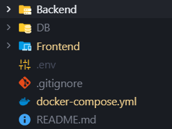
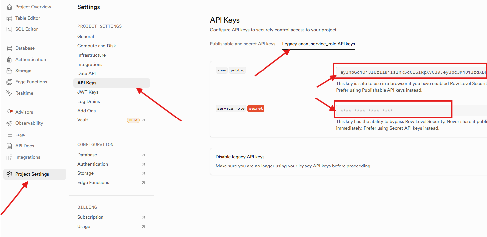
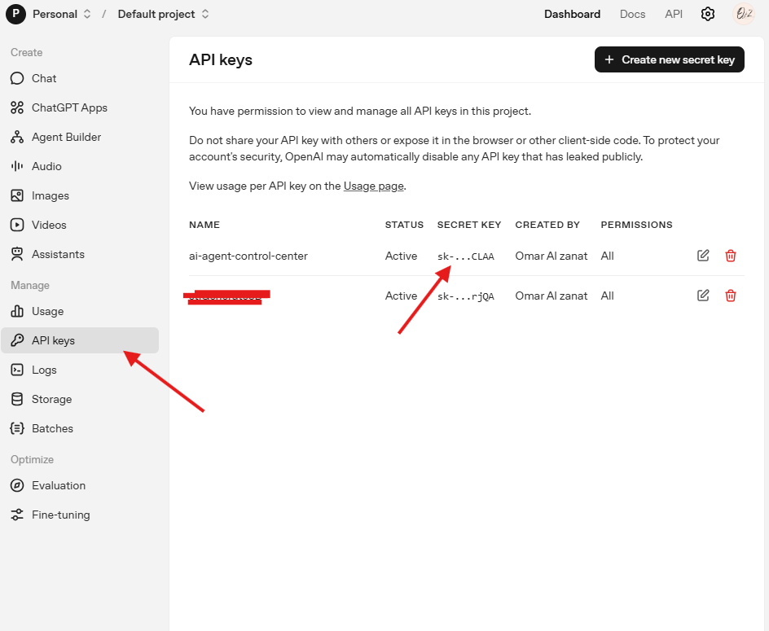

# 🚀 AI Agent Control Center

<h2 style="display:flex; justifyContent: center; alignContent: center"> 
    >>>
    <a href="https://ai-ojz.com"> 
        DEMO 
    </a>
    <<<
</h2>

## Architecture Overview
This project follows a decoupled Full-Stack Architecture designed for high availability and low-latency updates.
<ul>
    <li> 
        <strong>Frontend</strong>: 
        
Built with Next.js and Tailwind CSS, hosted on Netlify.
 
        It uses a custom domain ai-ojz.com configured via Hostinger DNS.
    </li>
    <li>
     <strong>Backend:</strong>
     
A Node.js/Express server written in TypeScript, hosted on Railway. 

    </li>
    <li>
     <strong>Real-Time Layer:</strong>
     
Handled by Socket.io using a unified HTTP server to broadcast agent telemetry (latency, token usage) every 2 seconds.

    </li>
    <li>
     <strong>Database:</strong>
     
Supabase (PostgreSQL) serves as the persistent storage for agent configurations and chat history.

    </li>
    <li>
     <strong>Orchestration:</strong>
     
Docker Compose is used to containerize the services for consistent local development.

    </li>
</ul>

## Setup Instructions
Follow these steps to run the entire stack locally using Docker.
<ol>
    <li>
        <strong>Prerequisites:</strong>
         <ul>
            <li> 
                Install 
                <a href="https://www.docker.com/products/docker-desktop/"> 
                Docker Desktop.
                </a>
            </li>
            <li>     
               A Supabase account with an active project.
            </li>
         </ul>
    </li>
     <li>
        <strong>
            Supabase setting up:
        </strong>
        

            <small style="background: #ffdd8e; padding: 5px; border-radius: 5px">
            We use  this method instead of prisma cli, because this is more fast, and have lower setup.
            </small>
        

        
 
            In your supabase website,
            New Organization >> New project >> go to sql Editor tab >> (Copy the SQL From DB Folder) then Past it in the supabase sql editor... now you have our tables.
        

    </li>
    <li>
        <strong> 
            Environment Configuration:
        </strong>
        
 Create a `.env` file in the **root** directory (beside the `docker-compose.yml`):

        <code>
            SUPABASE_URL=your_supabase_url
            SUPABASE_ANON_KEY=your_anon_key
            SUPABASE_SERVICE_ROLE_KEY=your_service_role_key
            CORS_ORIGINS=http://localhost:3000
            OPENAI_API_KEY=your_openai_api_key
            JWT_SECRET=eyJhbGciOiJIUzI1NiIsInR5cCI6IkpXVCJ9
        </code>
        

        <i> 
            To get Supabase api keys:
            Copy the both keys :
            
        </i>
        

        <i> To Get the open ai api key: (used in our project) </i>
            

                <a href="https://platform.openai.com/api-keys">
                Go to
            </a>
            

            
    </li>
    <li>
        <strong>
            Run with Docker:
        </strong>
        

            From the root folder, execute:
            

                <code >
                    docker compose up --build
                </code>
            

            
 
                <strong>Frontend:</strong>
                <a href="http://localhost:3000">
                http://localhost:3000
                </a>
            

            
 
                <strong>Backtend:</strong>
                <a href="http://localhost:4000">
                http://localhost:4000
                </a>
            

        

    </li>
</ol>

## API Documentation
The backend expose the following RESTful endpoints:

### SERVER:

Contains all the routes (auth/ chat/ agents / stats / message), and the socket in listner on httpserver, and the CORS setup. 

### SOCKET:

    Contains the setup of socket on (connection - join_room - leave_room - disconnect) 

### SUPABASE

Contains the configurations of supabase.

### MIDDLWARE: - Auth -

    Protect out API.

### AGENTS:

| Endpoint | Method | Desription |
| --- | --- | ---|
|/api/agents | GET | get all agents for logged in user|
|/api/agents | POST | insert new agent under user id, max agents = 5|
|/api/agents/:id | PATCH | update exist agent|
|/api/agents/:id/restore | PATCH | restore an archived agent |
|/api/agents/archived| GET | get the archived agents for the logged in user |
|/api/agents/:id | DELETE | delete permanently an agent under user id and agent id -not allowed for all users|

### CHATS:

| Endpoint | Method | Desription |
| --- | --- | ---|
|/api/chat | POST | here we post many data: insert into conversations tabel, the message table (contains the role), get response from openai, emit real time metric, save the openai response into the message table with role = assistant.|

### MESSAGES:

| Endpoint | Method | Desription |
| --- | --- | ---|
|/api/message/:agentId | GET | get the messages based on agent id and user id.| 

### STATS:

| Endpoint | Method | Desription |
| --- | --- | ---|
|/api/stats/my-tokens | GET | get only the total tokens for the role = assistant.|

### AUTH: Supabase
| Endpoint | Method | Desription |
| --- | --- | ---|
| /api/auth/forgot-password | POST | reset password for email using supabase -redirect to reset password-|
| /api/auth/reset-password | POST | update password for email, update user from supabase. |
|/api/auth/signup | POST | signup new user using supabase confirmation then insert it into  user table|
|/api/auth/login | POST | login using supabase, then get token with 24 hours as expired time.|

